# Architecture Diagram
## Predictive Analytics for Weather-Induced Infrastructure Failures

This document contains visual architecture diagrams in Mermaid format that can be rendered in Markdown viewers.

---

## System Architecture Overview

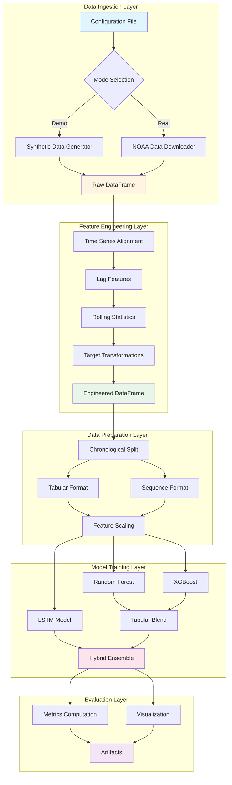

---

## Data Flow Diagram

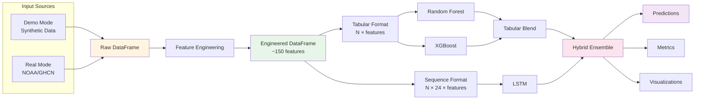

---

## Feature Engineering Pipeline

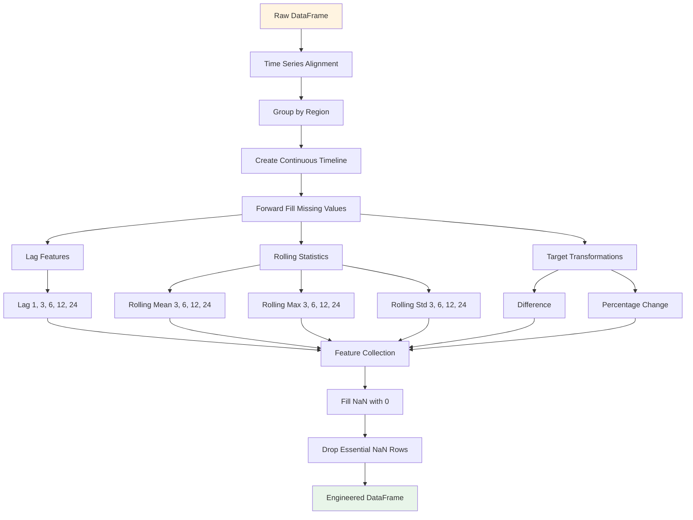

---

## Model Architecture

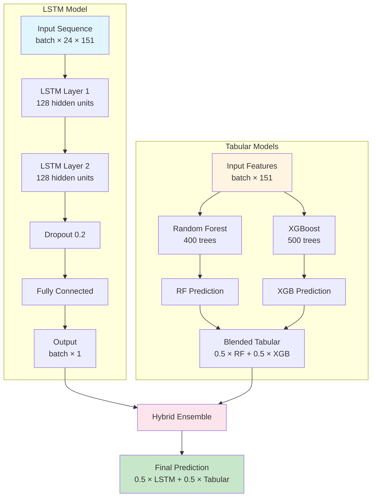

---

## Training Process Flow

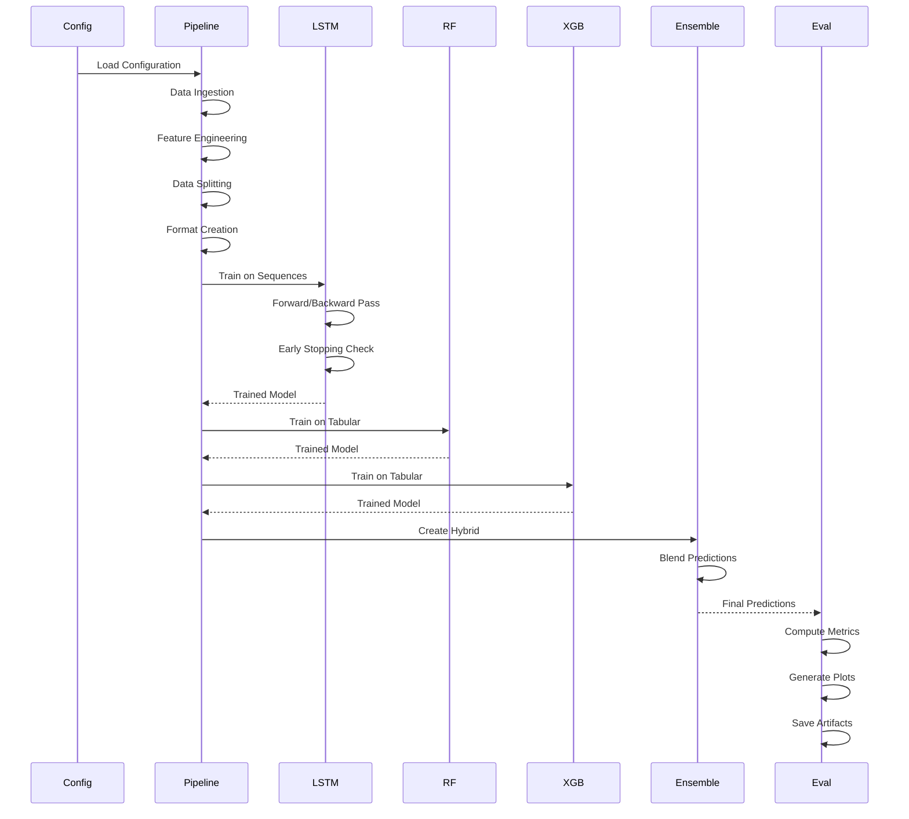

---

## Data Split Visualization

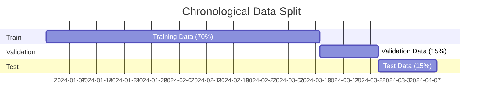

---

## Ensemble Blending Strategy

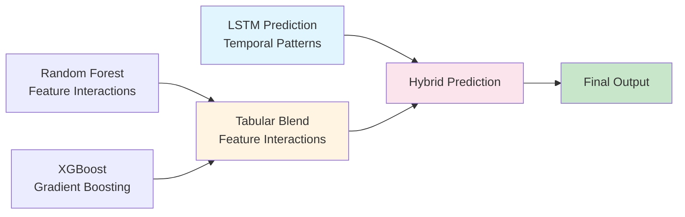

---

## Component Interaction Diagram

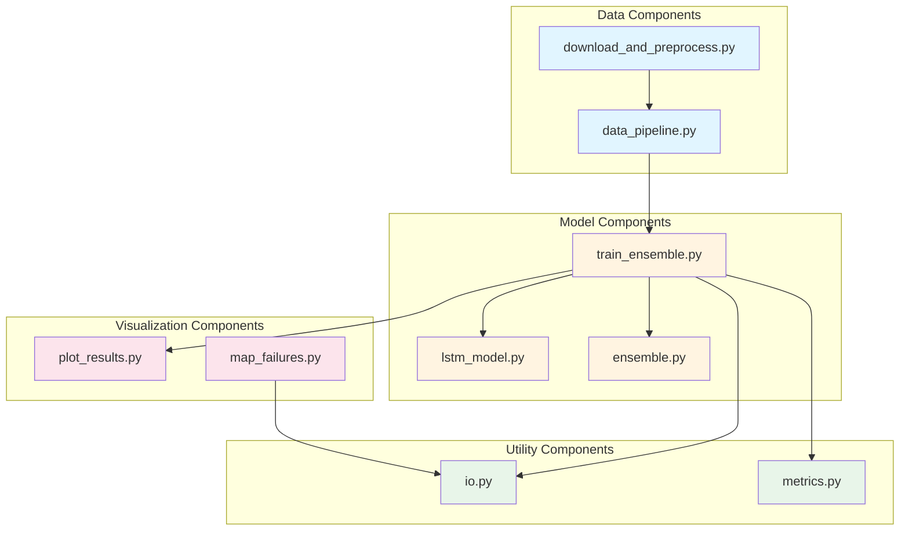

---

## Feature Engineering Details

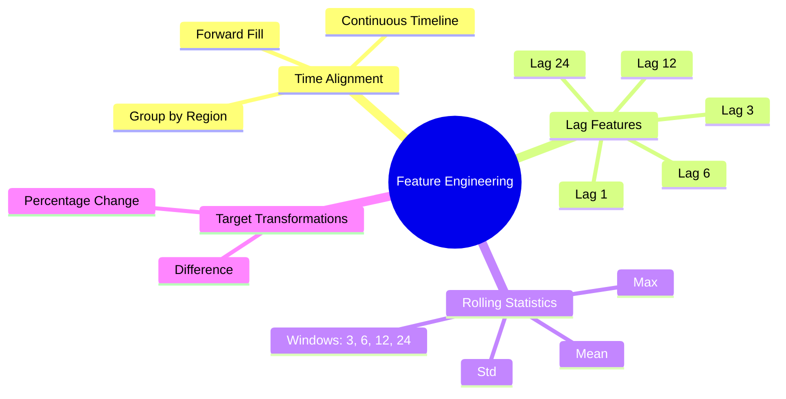

---

## Model Comparison

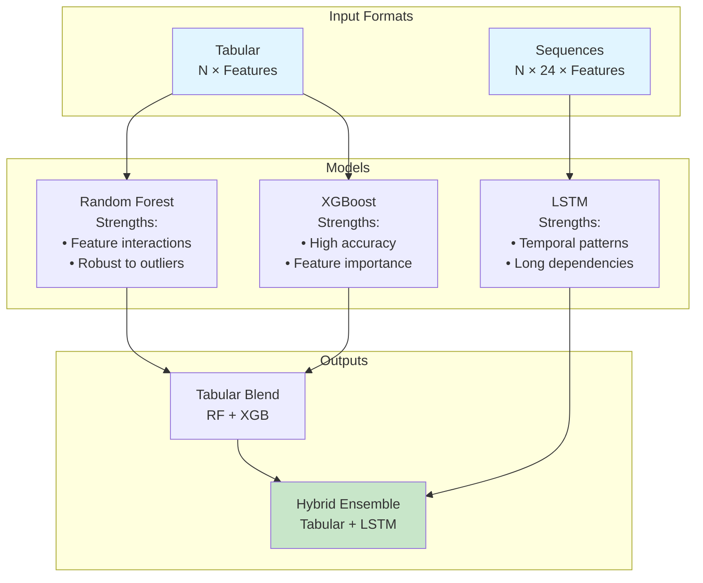

---

## Deployment Architecture

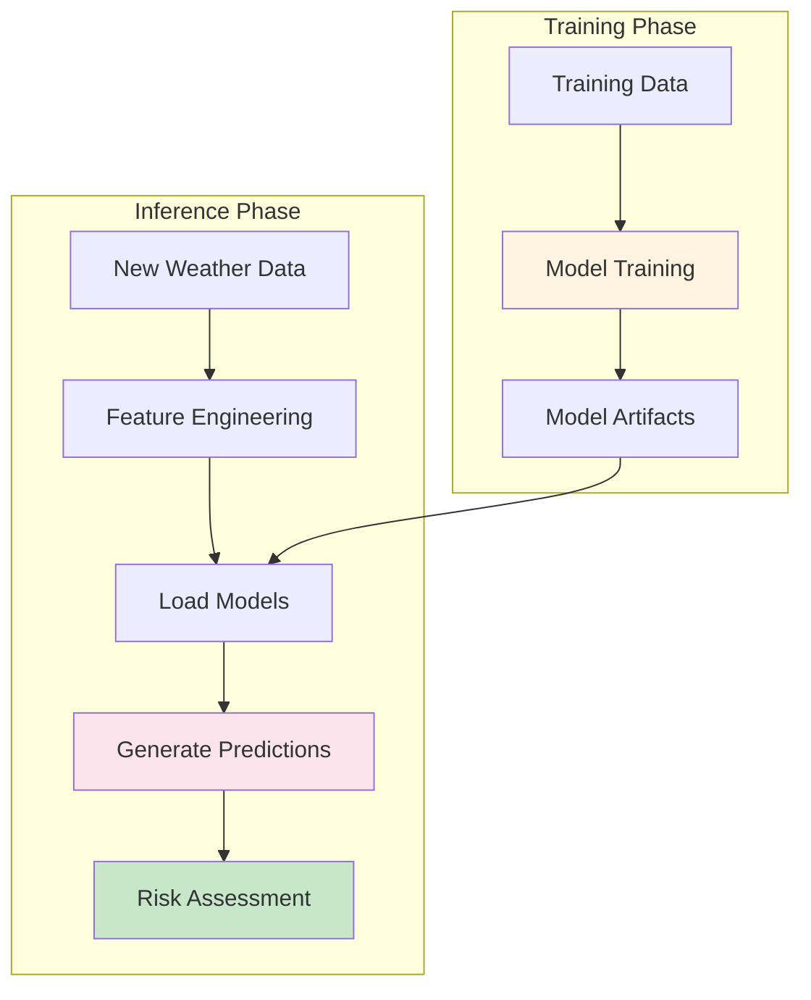

---

These diagrams provide visual representations of the system architecture, data flow, and component interactions. They can be rendered in Markdown viewers that support Mermaid (like GitHub, GitLab, or VS Code with Mermaid extension).

